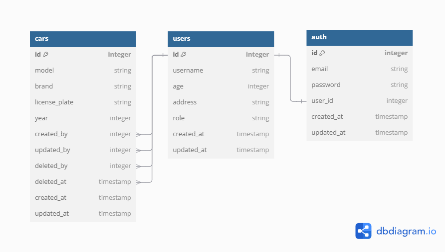

[](#)

# API Documentation With Postman And Swagger

This project provides API documentation using Postman and Swagger, along with an ERD diagram for the database structure.

## Prerequisites

Before installing this project, ensure [Node.js](https://nodejs.org/) and npm are installed.

## Installation

1. **Clone the repository** to the local machine.

    ```bash
    git clone https://github.com/TegarAlfaR/24001183-km7-tar-api-ch5.git
    cd project-name
    ```

2. **Install dependencies** using npm.

    ```bash
    npm install
    ```

3. **Run the project** (optional, if there is an API server to run).

    ```bash
    npm run dev
    ```

## Database Setup and Management

Sequelize is used as the ORM for database operations. The following commands can be run via `npm run` to manage the database:

- **Create the database**: 

    ```bash
    npm run db:create
    ```

- **Drop the database**:

    ```bash
    npm run db:drop
    ```

- **Run migrations**:

    ```bash
    npm run db:migrate
    ```

- **Undo the last migration**:

    ```bash
    npm run db:migrate:undo
    ```

- **Run all seeders**:

    ```bash
    npm run db:seed
    ```

- **Undo all seeders**:

    ```bash
    npm run db:seed:undo
    ```

## API Documentation

The API documentation is accessible through two main methods:

### 1. Postman Documentation

API documentation is available in Postman and can be accessed via the following link:

[](https://documenter.getpostman.com/view/38692295/2sAY4xB2Dy)

> **Postman Documentation Link**: [https://documenter.getpostman.com/view/38692295/2sAY4xB2Dy](https://documenter.getpostman.com/view/38692295/2sAY4xB2Dy)

### 2. Swagger Documentation

Swagger is used to generate OpenAPI-based documentation. To view the Swagger documentation:

- Run the API server and open the following URL in a browser:

    ```bash
    http://localhost:3000/api-docs
    ```
[](#)

## API Endpoints

### Base URL and Token

- **Base URL**: `http://localhost:3000/api/v1`
- **Token**: JWT authentication token, required for specific endpoints.
  - Example: `naiwofhoqh293882wb8273tb283bf8`

### Collections and Endpoints

#### 1. Cars

- **GET** `/cars` - Retrieve a list of cars. Requires `{{token}}`.
- **GET** `/cars/:id` - Retrieve a car by ID. Requires `{{token}}`.
- **POST** `/cars/create` - Create a new car entry. Requires `{{token}}`.
- **PATCH** `/cars/update/:id` - Update a car entry by ID. Requires `{{token}}`.
- **DELETE** `/cars/delete/:id` - Delete a car entry by ID. Requires `{{token}}`.
- **GET** `/cars/check-available` - Check car availability. Requires `{{token}}`.
- **GET** `/cars/log` - Retrieve car logs. Requires `{{token}}`.

#### 2. Health Check

- **GET** `/health-check` - Check the health status of the API.

#### 3. Auth

- **POST** `/login` - Log in and retrieve a JWT token.
- **POST** `/register` - Register a new user.
- **GET** `/current-user` - Retrieve the current authenticated user. Requires `{{token}}`.

#### 4. Users

- **GET** `/users` - Retrieve a list of users. Requires `{{token}}`.
- **GET** `/users/:id` - Retrieve a user by ID. Requires `{{token}}`.
- **POST** `/users/create` - Create a new user. Requires `{{token}}`.
- **PATCH** `/users/update/:id` - Update a user by ID. Requires `{{token}}`.
- **DELETE** `/users/delete/:id` - Delete a user by ID. Requires `{{token}}`.

## Database Structure

The database structure for this project is illustrated in the ERD diagram below:



---
